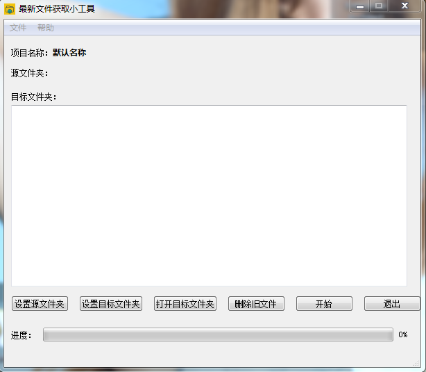
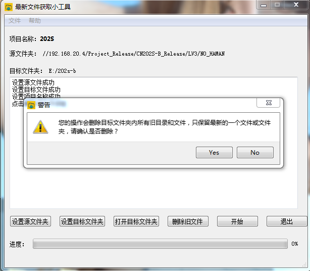
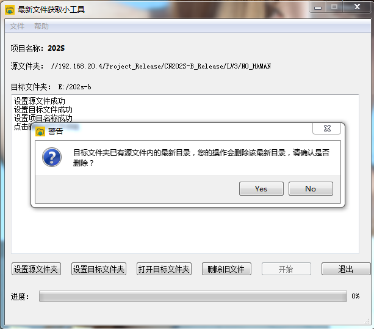
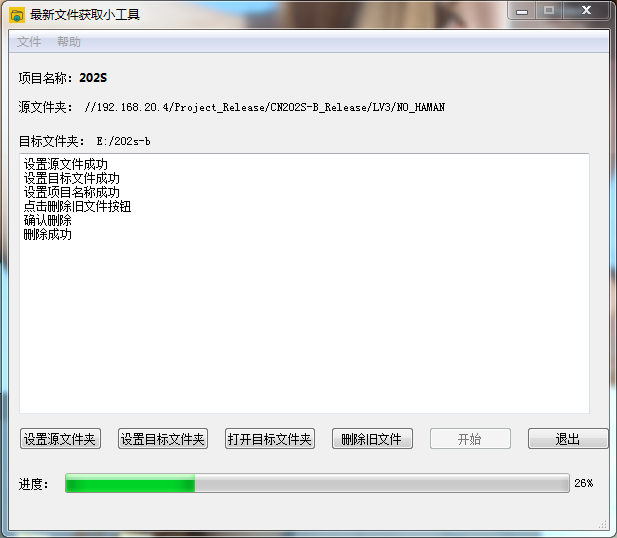

# 软件用法介绍：

<b>使用pyinstaller.exe打包的exe程序，在dist目录，可以直接在Windows下运行，可以不用环境直接看到最终效果</b>

## 主界面：

### 菜单栏
<b>文件-打开配置文件：</b>
打开配置文件，导入配置文件中的设置  
<b>文件-保存配置文件：</b>
将当前的配置另存为新的配置文件  
<b>文件-设置：</b>
修改项目名称  
<b>文件-退出：</b>
退出软件

### 按钮
<b>设置源文件夹：</b>设置要下载的文件的父文件夹  
<b>设置目标文件夹：</b>设置要拷入的文件夹  
<b>打开目标文件夹：</b>打开设置的目标文件夹  
<b>删除旧文件：</b>删除目标文件夹内的除最新的一个文件外的所有文件或者文件夹，
  删除前会进行提示，这里标注为<b>提示1</b>   
<b>开始：</b>将源文件夹内最新的一个文件或者文件夹拷贝至目标文件夹，如果目标文件夹内已经有该最新文件，会提示用户是否删除，这里标注为<b>提示2</b>   
<b>退出：</b>退出软件
#### 提示1：

#### 提示2：

### 正常使用界面：

